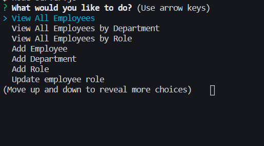
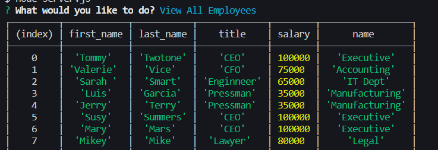
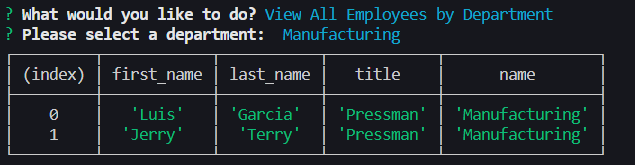
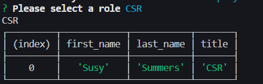
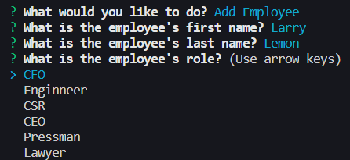
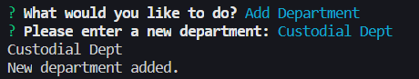
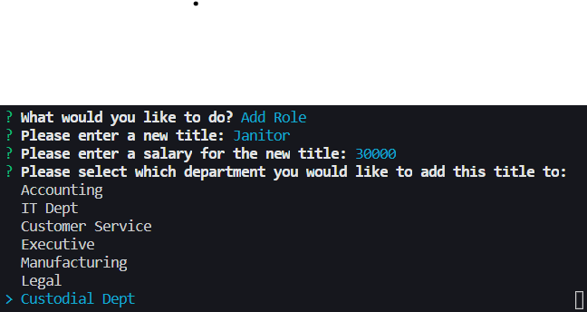
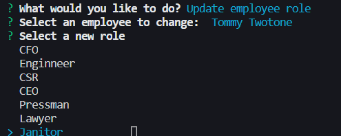
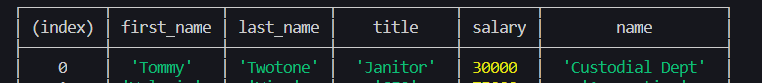

# Current Corperate Employee Tracker

  

   
  
  This project is designed to dynamically generate and manipulate a custom database of current/new employees.  

   

## Table of Contents

~[Installation](#installation)
~[Usage](#usage)
~[Contributing](#contributing)
~[Features](#features)
~[Tests](#tests)
~[License](#license)
~[Questions](#questions)

   

## Installation

  

  
  **To edit/use the application, please follow the steps to pull the repository from GitHub through Git Bash and pull the script into VSCode, provided all three items are already installed on a local network.  It also requires Node.JS to be installed on the local network as well as mySQL and the mySQL workbench.**

Instillation steps are as follows:

1. Access the repository at [Git Hub] https://github.com/Napica/HW-10-Corporate-Employee-Tracker.
2. Click on the code section (in green) and clone the SSH key.
3. Once the SSH key is cloned, open the terminal through Git Bash.
4. Find or create the folder the user wants to work in and enter the following commands the the Git terminal:
   1. git clone [copied link] (_this will allow access the repository to the local computer._)
   2. git pull (_this will pull all the lines of script from the local repository._)
   3. code . (\*This will extract the code and link the paths to VSCode for review/editing/uploading)
5. In the the terminal, please run "npm install" (as the dependencie should be there) to download the modules necessary for this project to work.  
6.  Copy and run the information in employeeDB.sql in the mySQL workbench to create a local database for your terminal to interface with.
7.  Once the modules are downloaded and the database is connected, please open up the terminal again and run "node ./server.js".  This will initialize the project and send you on your way to generating and maintianing your employee database. 

Please click on the link below to see a demonstration of the project:

1. https://drive.google.com/file/d/1hAret-SjXSaPXxbtixbboGVm0zKifgqk/view

   
   
  
  ## Usage 
  
  

  
   
  
 This project is used to generate and maintain an employee database.
     
     

  ## Contributing 
  
  

  
  #### Contributors 
  
 I would like to thank Raleigh C and Peter C for the massive assistance and help with the project. 
  
   
  
  ## Features
  

  
#### When installed properly,the user can run via the command below:
  
 

 

#### When the command above is ran, the user will be given a series of prompts and choices below. In chosing these sections, the user can generate and maintain an employee database. Examples are given below to show what this program can do.   
 

 

#### Once the prompt for viewing all employees is selected:

 

#### Once the prompt for viewing employees by department is chosen and a targeted department is selected:

 

#### Once the prompt for viewing employee by role is chosen and a targeted department is selected:

 

#### Once the prompt for adding an employee with a role is chosen and additional prompts are entered:

 

#### Once the prompt for adding another department is chosen and additional prompts are entered:

 

#### Once the prompt for adding a role to a department is chosen and additional prompts are entered:

 

#### Once the prompt for updating an employee by role is chosen and additional prompts are entered:

## Tests

  

  
  
  If you would like to go about testing this project, please install the project on a local server for testing.   

   
  
  ## License 
  
  

  
  This application is licensed under MIT

   

## Questions

  

  
  #### If you would like to know more, please contact or see any other projects at [napica](https://github.com/napica)
